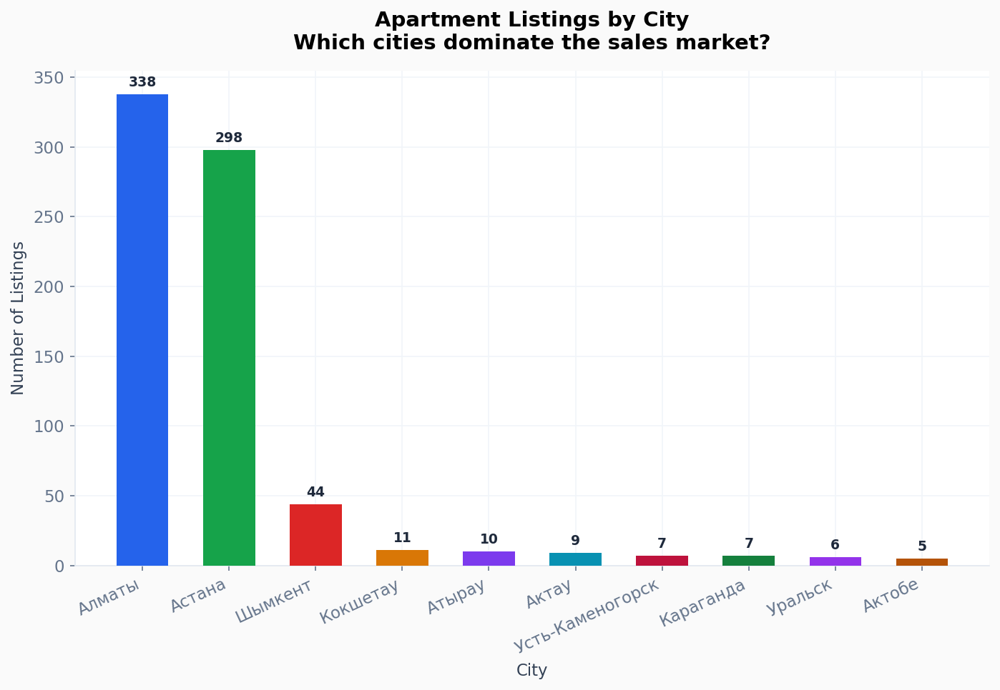
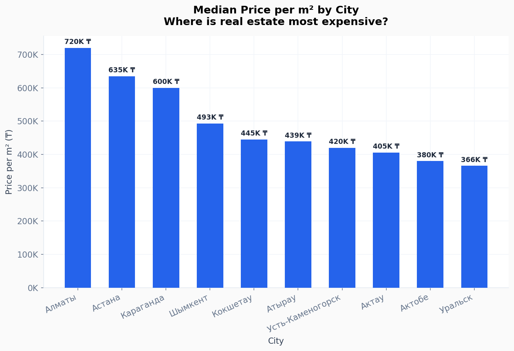
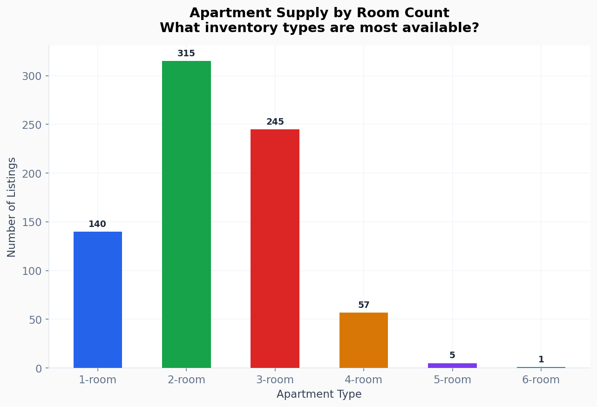
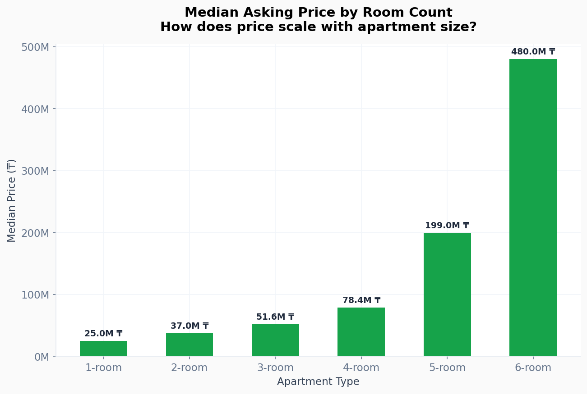
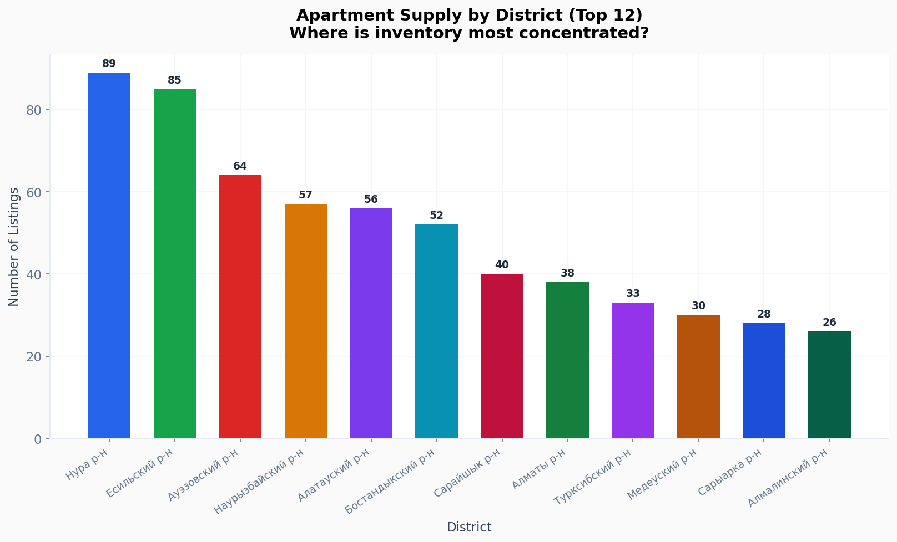
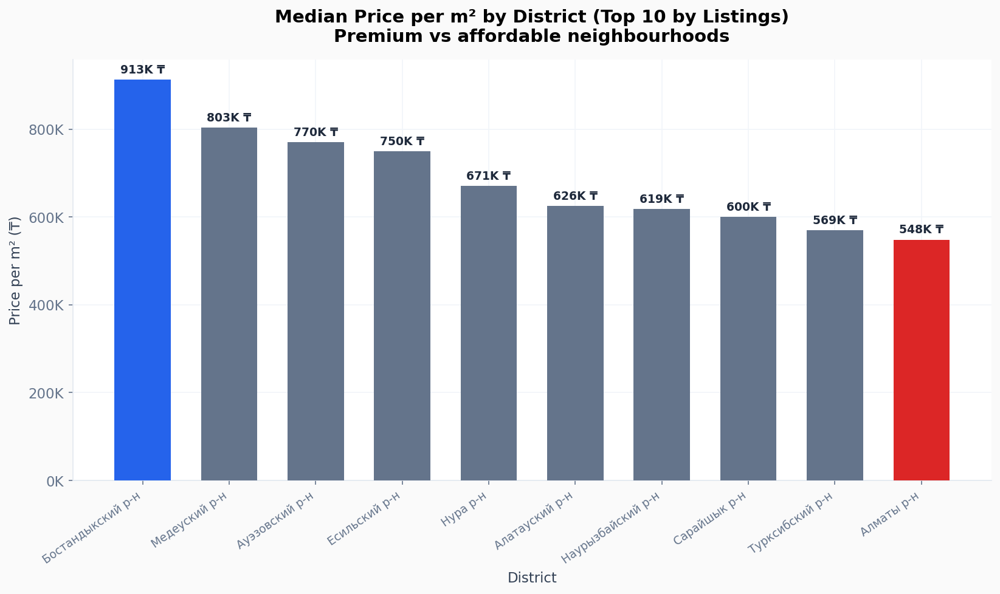
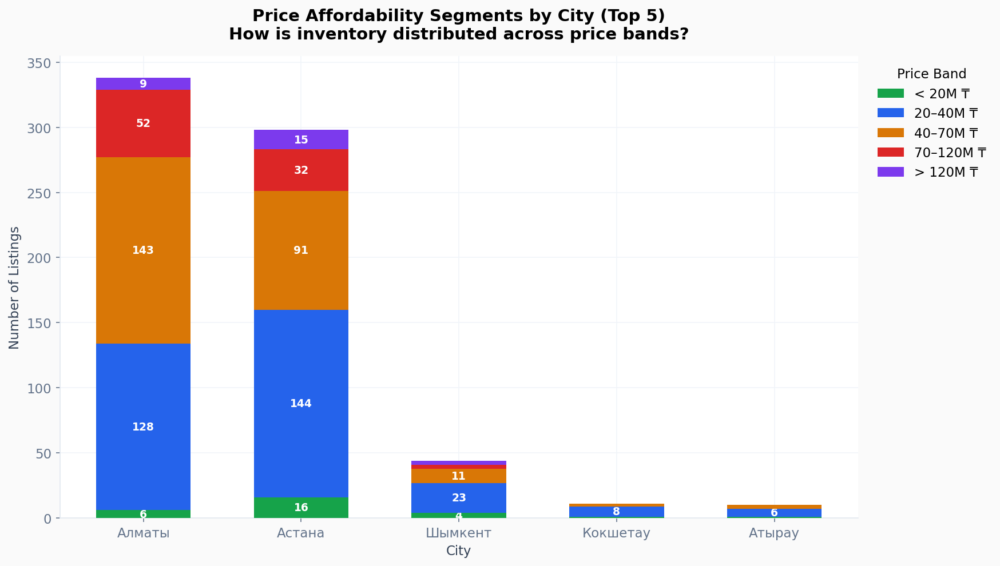
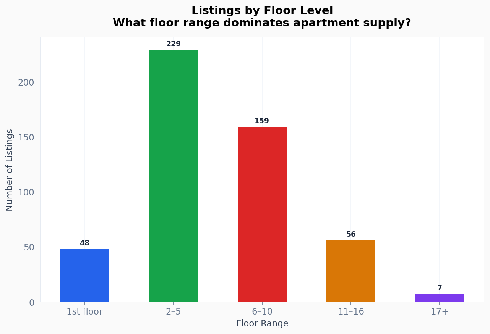
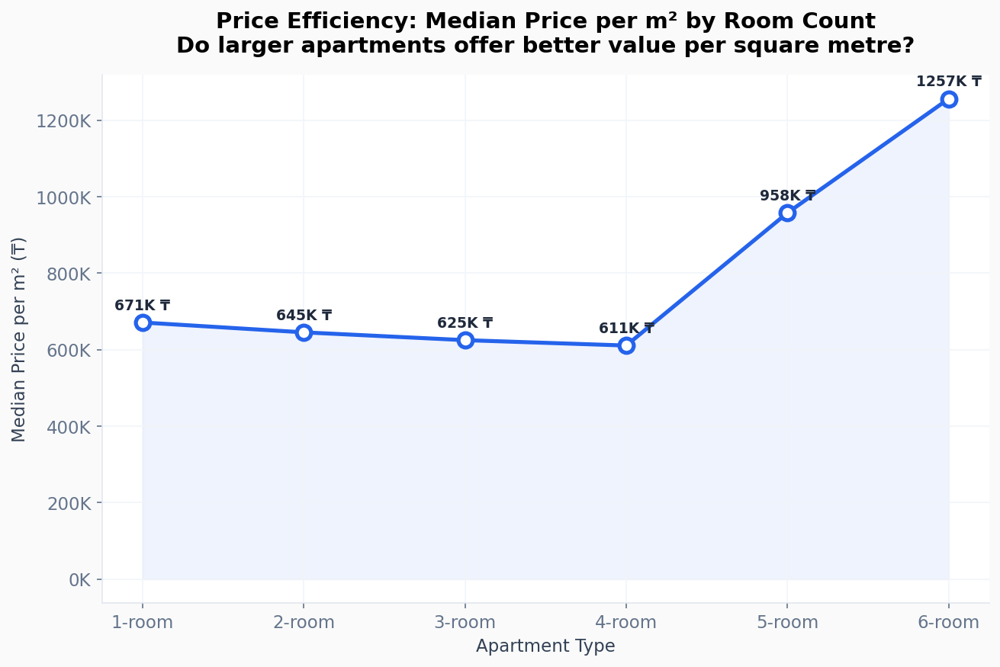
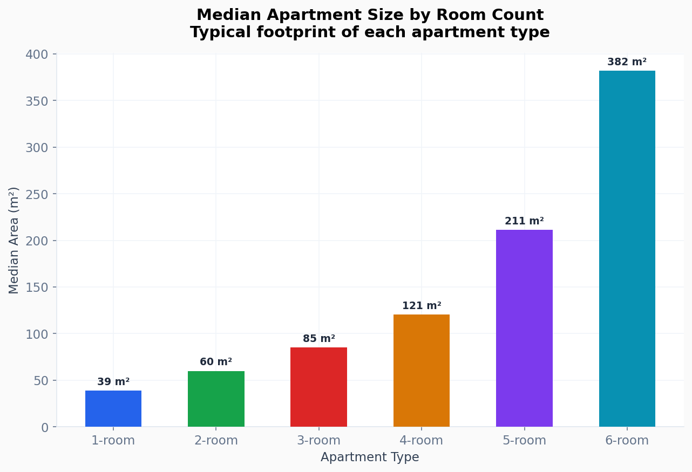

# Kazakhstan Apartment Market — Executive Insight Report

> - **Data source:** Krisha.kz — Kazakhstan's largest real estate marketplace
> - **Sample:** 763 active apartment listings across major cities
> - **Focus:** Almaty · Astana · Shymkent and regional markets

---

## Market Overview

The dataset covers the primary apartment resale market across Kazakhstan's key urban centres. Prices range from **6.7M ₸** to **480M ₸**, with a median asking price of **40M ₸**. Price per square metre spans **129K ₸ to 2.1M ₸**, with a market median of **639K ₸/m²** — confirming a wide range of market segments from affordable housing to premium real estate.

---

## 1. City-Level Supply — Where Inventory Is Concentrated

**What this shows:** Almaty and Astana together account for over 83% of all listings, making them by far the dominant markets. Shymkent is a distant third at roughly 6%, followed by smaller regional cities at under 2% each.

**Why it matters:** Sellers and developers are overwhelmingly concentrated in two cities. Any platform, agency, or investment strategy that is not Almaty/Astana-first is operating against the direction of supply.

**Action:** Prioritise Almaty and Astana for sales capacity, marketing spend, and agent recruitment. Regional cities represent an underserved opportunity — low competition, but also low demand volume today.

---

## 2. Where Real Estate Is Most Expensive

**What this shows:** Almaty commands the highest price per square metre, with a median around **700–750K ₸/m²** — meaningfully above Astana and all regional cities. Shymkent and provincial markets sit 30–50% lower.

**Why it matters:** Almaty is not just the largest market — it is the most expensive. Buyers, investors, and developers face structurally higher capital requirements there, while regional markets offer lower entry points.

**Action:** Investors seeking yield over capital growth should compare Almaty's premium price against rental returns. Regional cities may offer better cap rates for buy-to-let strategies. Premium agencies should double down on Almaty; value-focused players should expand regionally.

---

## 3. Apartment Type Supply — What Buyers Can Choose From

**What this shows:** 2-room apartments are the single largest inventory segment (41%), followed by 3-room (32%) and 1-room (18%). 4-room and above account for just 8% of listings.

**Why it matters:** The market is structurally biased toward mid-size apartments. Demand for 1-room (studio/single) units may be underserved relative to the growing urbanisation trend and single-person/young-couple demographics.

**Action:** Developers and investors acquiring for resale should focus on 2–3 room stock, as liquidity is highest there. 1-room units may see less competition from sellers and stronger demand from young urban buyers and rental investors.

---

## 4. How Price Scales with Apartment Size

**What this shows:** Median asking prices climb steadily from **~20M ₸** for 1-room units to **~120M ₸+** for 5–6 room apartments. The step from 3-room to 4-room is particularly steep.

**Why it matters:** This price ladder defines the affordability ceiling at each life stage. Most families cannot stretch beyond 3-room at the median price of ~55M ₸ without significant financing. The 4-room+ segment is effectively a luxury market.

**Action:** Mortgage product designers and bank partners should model affordability stress tests around the 40–55M ₸ band. Sellers pricing 4-room+ units should expect a longer time on market and a narrower buyer pool.

---

## 5. District-Level Supply — The Neighbourhood Concentration Map

**What this shows:** Нура р-н (Nur district, Astana) and Есильский р-н (Yesil, Astana) lead in listing volume, followed by several Almaty districts. Supply is spread across 12+ named districts, indicating no single neighbourhood monopolises the market.

**Why it matters:** High supply in new development districts (e.g. Нура, Есильский in Astana) signals active new construction and secondary sales from investors who bought off-plan. Established Almaty districts (Ауэзовский, Бостандыкский) reflect mature resale markets.

**Action:** New buyer campaigns should target high-supply districts where choice is greatest. Agents and platforms should invest in local expertise in top-5 districts — that is where the deal flow is.

---

## 6. Premium vs Affordable Neighbourhoods

**What this shows:** Price per m² varies significantly across the most active districts. The most expensive district commands nearly **2× the price per m²** of the most affordable in the top-10 by volume. Медеуский р-н (Medeu, Almaty) typically leads on price; peripheral districts in Astana and Almaty trail.

**Why it matters:** District selection is the single biggest driver of price within a city. A buyer choosing between two similar-sized apartments in different districts can face a 30–50% price difference.

**Action:** Buyers optimising value for money should compare Медеуский р-н pricing against adjacent districts. Sellers in premium districts should market internationally — these units attract diaspora and foreign buyers. Budget buyers should be directed to Наурызбайский, Алатауский, and Турксибский districts first.

---

## 7. Affordability Segmentation by City

**What this shows:** Almaty skews heavily toward the 40–120M ₸ range, with a meaningful share of listings above 120M ₸. Astana has a broader distribution including more sub-40M ₸ options. Shymkent is dominated by affordable listings under 40M ₸.

**Why it matters:** Each city serves a structurally different buyer profile. Almaty is predominantly an upgrade and premium market. Astana serves both entry-level and mid-tier buyers. Shymkent is an affordable and first-home market.

**Action:** Marketing, mortgage partners, and agent scripts should be calibrated per city. Almaty listings need premium positioning and high-net-worth targeting. Astana needs a two-track approach. Shymkent campaigns should lead with affordability and first-home buyer messaging.

---

## 8. Floor Level — What Stock Actually Looks Like

**What this shows:** Mid-rise floors (2–5 and 6–10) dominate available inventory. High-floor listings (17+) are a small minority. Ground-floor (1st floor) stock is limited but present.

**Why it matters:** Buyers consistently prefer mid-to-upper floors for security, noise, and views — but the market broadly reflects this preference in its stock composition. 1st-floor units typically trade at a discount.

**Action:** Agents listing 1st-floor units should price competitively and lead with practical benefits (accessibility, no lift dependency). High-floor premium units (17+) are rare and can be positioned as a scarcity play for the right buyer segment.

---

## 9. Price Efficiency — Do Larger Apartments Offer Better Value?

**What this shows:** Price per m² generally declines as apartment size increases — 1-room units are the most expensive per m², and larger apartments offer progressively more space per tenge spent. The curve flattens at 4–5 rooms.

**Why it matters:** From a pure space-value standpoint, buying a larger apartment is more efficient. However, the total capital required rises sharply, creating an affordability barrier. 2-room apartments sit at the sweet spot: better per-m² value than 1-room, with far lower total outlay than 3-room+.

**Action:** Buyers and rental investors optimising for yield per tenge should target 2-room apartments. 1-room units command a per-m² premium — sellers of 1-room stock should not under-price. Communicate the "size value" story to buyers upgrading from 1 to 2 rooms.

---

## 10. Typical Apartment Size by Type

**What this shows:** Median apartment sizes follow an expected step pattern — from ~38m² for 1-room units up to ~140m²+ for 5-room apartments. 2-room units cluster around 55m² and 3-room around 80m².

**Why it matters:** These benchmarks define what "standard" means in the Kazakhstani market. Anything significantly below the median area for a room count likely trades at a discount; anything above competes on size as a differentiator.

**Action:** Developers should use these benchmarks when planning unit mix. Below-benchmark units should be priced at a discount or repositioned as efficient/compact. Above-benchmark units can command a size premium in marketing collateral.

---

## Key Strategic Takeaways

| # | Insight | Implication |
|---|---------|-------------|
| 1 | Almaty + Astana = 83% of supply | All major strategies must be city-specific |
| 2 | Almaty is 30–50% more expensive per m² than other cities | Premium positioning required; different buyer profiles |
| 3 | 2-room apartments dominate supply (41%) | Highest liquidity; best bet for resale and rental investors |
| 4 | 4-room+ is effectively a luxury segment | Expect slower sales; target HNW and diaspora buyers |
| 5 | District choice drives 30–50% price variance within a city | Neighbourhood-level marketing and pricing is essential |
| 6 | 1-room units carry the highest price per m² | Do not under-price; position as urban efficiency product |
| 7 | Shymkent is a structurally affordable, underserved market | First-mover advantage for agencies expanding regionally |

---

*Report generated from Krisha.kz listing data · March 2026*
