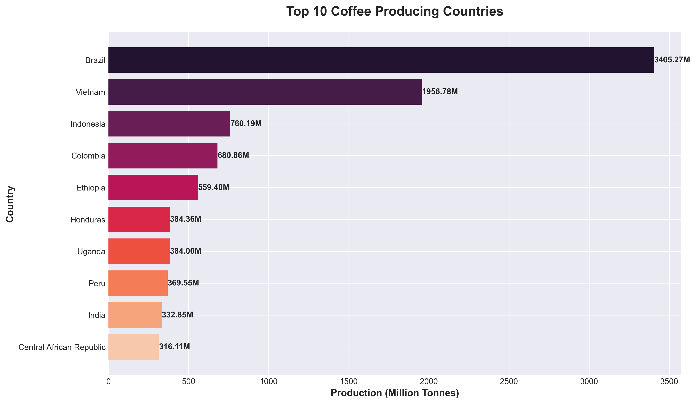
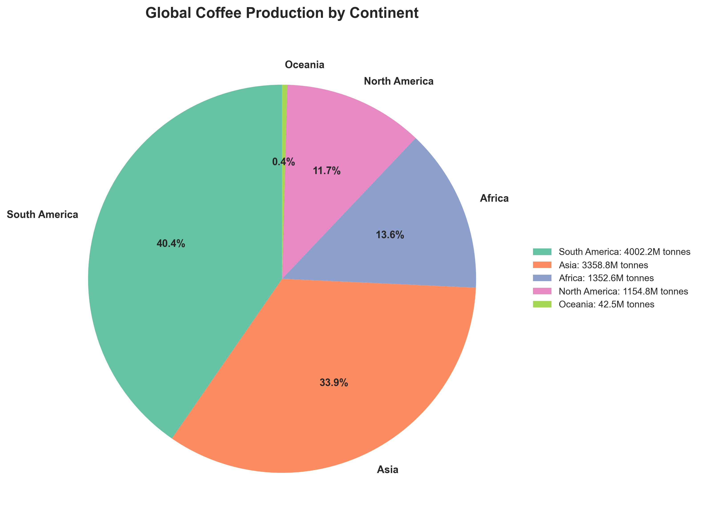
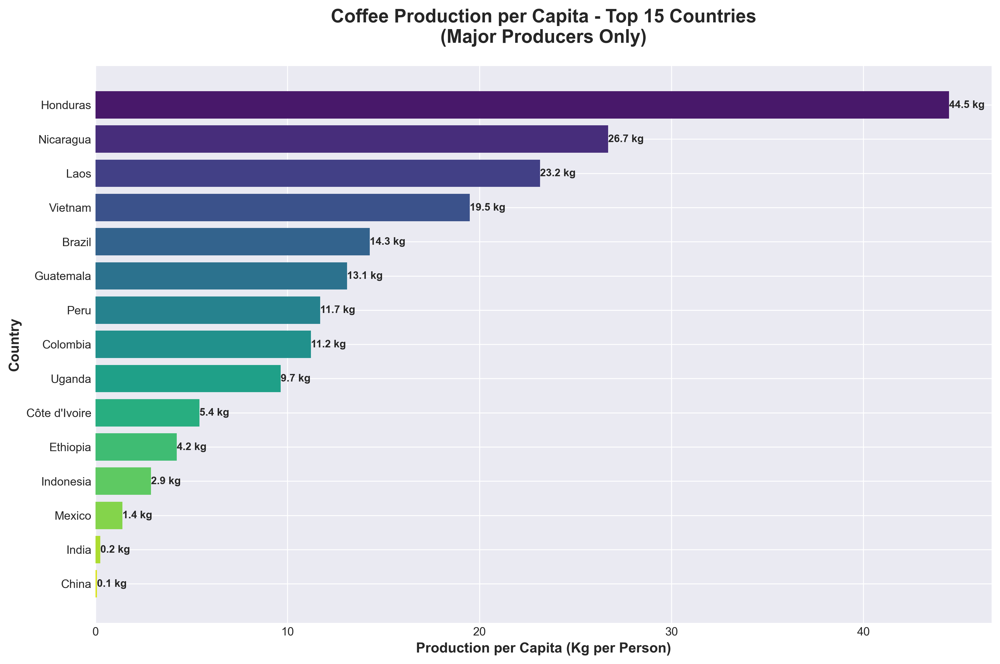
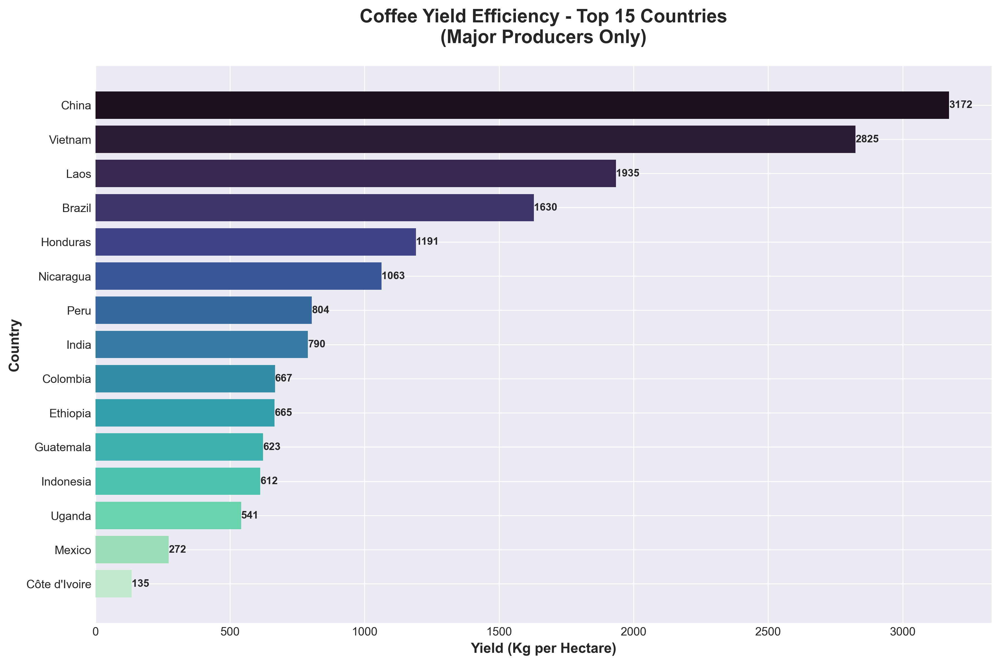
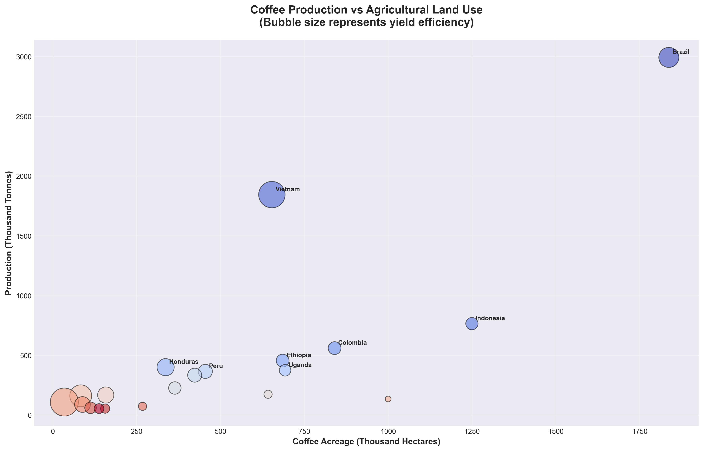
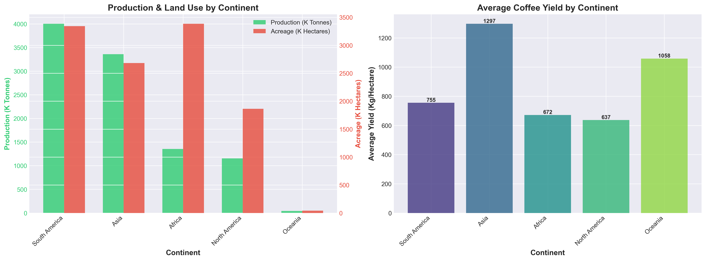
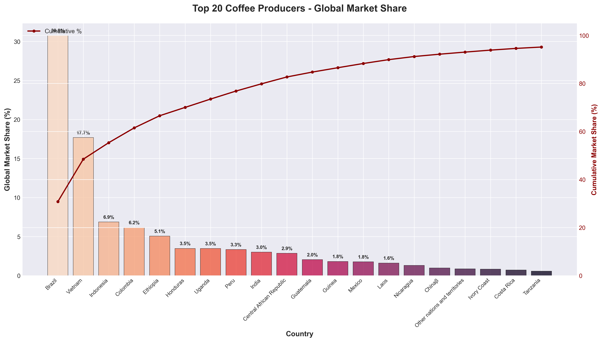

# Global Coffee Production Analysis

> A comprehensive data-driven analysis of worldwide coffee production patterns, efficiency metrics, and market dynamics.

---

## Executive Summary

This analysis examines global coffee production data from multiple authoritative sources, revealing critical insights into production volumes, regional distribution, agricultural efficiency, and market concentration. Our findings highlight the dominance of key producing nations, significant regional disparities in farming efficiency, and the strategic importance of coffee cultivation in various economies.

### Key Statistics

| Metric | Value |
|--------|-------|
| **Total Global Production** | 11.06 Million Tonnes |
| **Countries Analyzed** | 78 Countries |
| **Leading Producer** | Brazil (30.8% market share) |
| **Top 5 Market Control** | 66.5% of global production |
| **Top 10 Market Control** | 82.7% of global production |
| **Average Yield Efficiency** | 896 kg/hectare |

---

## 1. Global Production Landscape

### Top Coffee Producing Nations

Brazil stands as the undisputed leader in global coffee production, producing over 3.4 million tonnes annually - representing nearly one-third of the world's total coffee supply. Vietnam follows as a distant second, with Indonesia, Colombia, and Ethiopia rounding out the top five producers.



#### Finding: **Brazil Dominates Global Coffee Production**

Brazil leads with 3,405.27 thousand tonnes, producing **30.8%** of global coffee. This volume is **1.7x more** than Vietnam, the second-largest producer. This dominance reflects Brazil's:
- Ideal climate conditions for coffee cultivation
- Large-scale agricultural infrastructure
- Historical expertise in coffee farming
- Significant land allocation to coffee plantations

The gap between Brazil and other producers underscores the country's strategic position in controlling global coffee supply and pricing dynamics.

---

## 2. Regional Distribution & Continental Analysis

### Coffee Production by Continent

The global coffee belt spans across multiple continents, with South America and Asia emerging as the powerhouses of coffee production. Africa, despite being coffee's ancestral home, accounts for a smaller but significant portion of global output.



#### Finding: **South America Leads Continental Production**

South America accounts for **40.4%** of global coffee production, followed by Asia at **33.9%**. Key insights:

- **South America**: Dominated by Brazil and Colombia, benefiting from optimal growing conditions
- **Asia**: Led by Vietnam and Indonesia, showing rapid growth in recent decades
- **Africa**: Despite being the origin of Arabica coffee, contributes approximately 20% due to smaller-scale farming operations
- **North America**: Central American countries like Honduras, Guatemala, and Costa Rica maintain significant production

This distribution reflects both historical cultivation patterns and modern agricultural economics.

---

## 3. Production Efficiency: Per Capita Analysis

### Which Countries Depend Most on Coffee?

Beyond total production volume, analyzing per capita production reveals which economies are most heavily invested in coffee cultivation. This metric indicates the relative importance of coffee to a nation's agricultural sector and economy.



#### Finding: **Honduras Shows Highest Production Efficiency per Capita**

Honduras leads in per capita production with **44.5 kg per person**, indicating coffee is a crucial part of their economy and agricultural sector. This finding reveals:

- **Economic Dependence**: Small nations like Honduras, Nicaragua, and Laos show high per capita production, suggesting coffee is central to their economies
- **Employment Impact**: Higher per capita production indicates more citizens involved in coffee farming
- **Export Revenue**: These countries rely heavily on coffee exports for foreign exchange
- **Agricultural Focus**: Limited economic diversification makes coffee cultivation strategically critical

In contrast, large producers like Brazil and Vietnam have lower per capita figures due to their larger populations and more diversified economies.

---

## 4. Agricultural Productivity: Yield Analysis

### Yield Efficiency Across Major Producers

Yield per hectare measures agricultural efficiency - how much coffee is produced from each unit of land. This metric reveals which countries employ the most advanced farming techniques, better crop management, and optimal growing conditions.



#### Finding: **China Demonstrates Superior Agricultural Efficiency**

China achieves the highest yield at **3,172 kg/hectare**, which is **2.8x higher** than the average of 1,128 kg/hectare, showcasing advanced farming techniques. Analysis shows:

- **Technology Advantage**: China's high yield reflects precision agriculture, optimal irrigation, and crop management
- **Intensive Farming**: Smaller land areas necessitate maximum efficiency per hectare
- **Regional Variations**: Traditional producers vary widely - Vietnam (2,825 kg/ha) vs. Mexico (272 kg/ha)
- **Improvement Potential**: Lower-yield countries could significantly boost production through agricultural modernization

The stark difference between high-yield and low-yield countries suggests enormous potential for productivity improvements in traditional coffee-growing regions.

---

## 5. Land Use vs. Production Analysis

### Correlation Between Acreage and Output

This scatter plot analysis reveals the relationship between land dedicated to coffee cultivation and actual production output. The bubble size represents yield efficiency, highlighting which countries maximize their agricultural resources.



#### Finding: **Strong Correlation Between Land Use and Production**

There is a **0.76 correlation** between acreage and production. However, bubble size variations show that yield efficiency varies significantly, with some countries producing more with less land through advanced agricultural practices.

**Key Observations:**
- **Brazil**: Largest land area and highest production, but moderate yield efficiency
- **Vietnam**: Smaller land area but very high efficiency (large bubble), maximizing output
- **Indonesia**: Large acreage with lower efficiency, indicating potential for improvement
- **China**: Small acreage but exceptional efficiency (largest bubble per unit)

This visualization demonstrates that while land area matters, **agricultural efficiency is equally critical** to production success. Countries with limited land can compete through superior farming practices.

---

## 6. Regional Comparative Analysis

### Production Volume, Land Use, and Efficiency by Continent

A multi-dimensional analysis comparing continents across production volume, agricultural land use, and average yield efficiency reveals distinct regional strategies and capabilities.



#### Finding: **Regional Efficiency Varies Significantly**

Asia shows the highest average yield at **1,297 kg/hectare**, while production volume is concentrated in South America and Asia due to larger agricultural areas dedicated to coffee cultivation.

**Continental Strategies:**

1. **South America**
   - Highest total production
   - Large land allocation
   - Moderate yield efficiency
   - Strategy: Volume-based production

2. **Asia**
   - High production volume
   - Most efficient yield per hectare
   - Intensive farming practices
   - Strategy: Efficiency-focused cultivation

3. **Africa**
   - Moderate production
   - Large land allocation
   - Lower average yields
   - Opportunity: Significant yield improvement potential

4. **North America** (Central America)
   - Moderate production
   - Balanced land use
   - Good yield efficiency
   - Strategy: Quality-focused specialty coffee

---

## 7. Market Concentration Analysis

### Global Market Share Distribution

Understanding market concentration reveals the power dynamics in global coffee production. This analysis shows how much control the top producers exert over global supply.



#### Finding: **Market Concentration in Top Producers**

The top 5 coffee producing countries control **66.5%** of global production, while the top 10 account for **82.7%**. This shows significant market concentration in a few major producing nations.

**Implications:**

1. **Price Control**: Top producers have significant influence over global coffee prices
2. **Supply Risk**: Market concentration creates vulnerability to regional disruptions (weather, disease, political instability)
3. **Competitive Barriers**: New entrants face challenges competing with established producers
4. **Strategic Importance**: Coffee production is geopolitically significant for these nations

The cumulative curve shows that just **3 countries** (Brazil, Vietnam, Indonesia) control over **50%** of global production, demonstrating extreme concentration at the very top of the market.

---

## Key Insights & Strategic Recommendations

### Major Findings

1. **Market Dominance**: Brazil's production dwarfs all competitors, maintaining strategic control over global supply

2. **Regional Powerhouses**: South America and Asia together produce over 74% of the world's coffee

3. **Efficiency Divide**: A 20x difference exists between the most and least efficient producers (China at 3,172 kg/ha vs. basic producers around 150 kg/ha)

4. **Economic Importance**: For smaller nations like Honduras and Nicaragua, coffee represents a critical economic lifeline with production exceeding 20+ kg per capita

5. **Growth Potential**: African producers, despite having coffee's ancestral home and significant land allocation, show substantial room for yield improvement

### Strategic Opportunities

#### For Producing Countries:
- **Efficiency Gains**: Countries with low yields could double or triple production through better practices
- **Technology Transfer**: Learning from high-yield countries (China, Vietnam) could revolutionize traditional farming
- **Value Addition**: Moving beyond commodity exports to specialty coffee markets
- **Diversification**: Reducing economic vulnerability through agricultural diversification

#### For Global Coffee Industry:
- **Supply Chain Resilience**: Reducing dependence on top 3 producers through supporting emerging producers
- **Sustainability**: Addressing climate change impacts on major producing regions
- **Quality Focus**: Balancing quantity with specialty coffee market growth
- **Fair Trade**: Ensuring economic benefits reach smallholder farmers

---

## Methodology

### Data Sources

1. **Wikipedia**: Global coffee production statistics (FAOSTAT UN data)
2. **AtlasBig**: Comprehensive production metrics including acreage and yield data
3. **USDA Foreign Agricultural Service**: (Connection timeout - not included in this analysis)

### Analysis Tools

- **Python 3** for data extraction and analysis
- **Pandas** for data manipulation
- **Matplotlib & Seaborn** for visualization
- **BeautifulSoup** for web scraping

### Metrics Analyzed

- **Production Volume**: Total tonnes produced annually
- **Production per Capita**: Kg per person (economic importance indicator)
- **Acreage**: Hectares dedicated to coffee cultivation
- **Yield Efficiency**: Kg produced per hectare (productivity metric)
- **Market Share**: Percentage of global production

---

## Technical Implementation

### Repository Structure

```
coffee_production_analyse/
├── charts/                    # Generated visualization charts
├── coffee_data/               # Extracted CSV datasets
├── extract_coffee_tables.py   # Web scraping script
├── generate_charts.py         # Analysis and visualization script
├── insights.json              # Extracted findings (machine-readable)
└── README.md                  # This presentation document
```

### Reproduction

To reproduce this analysis:

```bash
# 1. Extract data from web sources
python3 extract_coffee_tables.py

# 2. Generate charts and insights
python3 generate_charts.py

# Charts will be saved in ./charts/
# Insights will be saved in insights.json
```

---

## Conclusions

This comprehensive analysis reveals a global coffee industry characterized by:

1. **Extreme concentration** in a handful of producing nations
2. **Significant efficiency gaps** between traditional and modern farming approaches
3. **Critical economic importance** for developing nations
4. **Substantial growth potential** through agricultural modernization

The data demonstrates that while coffee production is dominated by Brazil and a few other major players, there exists tremendous opportunity for efficiency improvements, particularly in African and some Central American countries. The future of coffee production will likely depend on balancing sustainability, efficiency improvements, and economic development in producing regions.

As climate change increasingly threatens traditional growing regions, the industry must adapt through diversification, technology adoption, and sustainable farming practices to ensure long-term stability in global coffee supply.

---

## About This Analysis

**Created**: December 2024
**Data Coverage**: Latest available production data
**Analysis Type**: Descriptive statistical analysis with data visualization
**Purpose**: Educational and informational presentation of global coffee production patterns

---

*For questions, suggestions, or collaboration opportunities, please refer to the repository documentation.*
